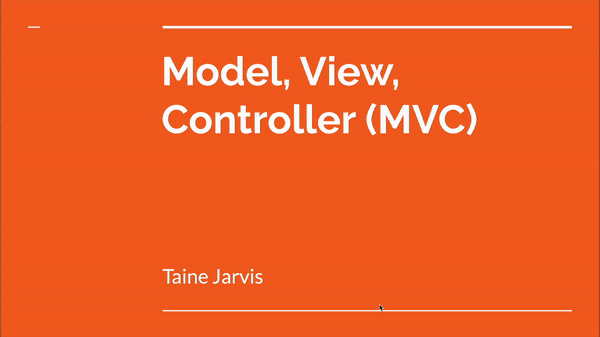

# Model, View, Controller 
A detailed presentation I developed on the MVC architectural pattern used in software development.

## Lessons Learned:

Crafting this presentation deepened my comprehension of the MVC architecture, enhancing my ability to produce code that is not only more structured but also easier to maintain across various projects.

